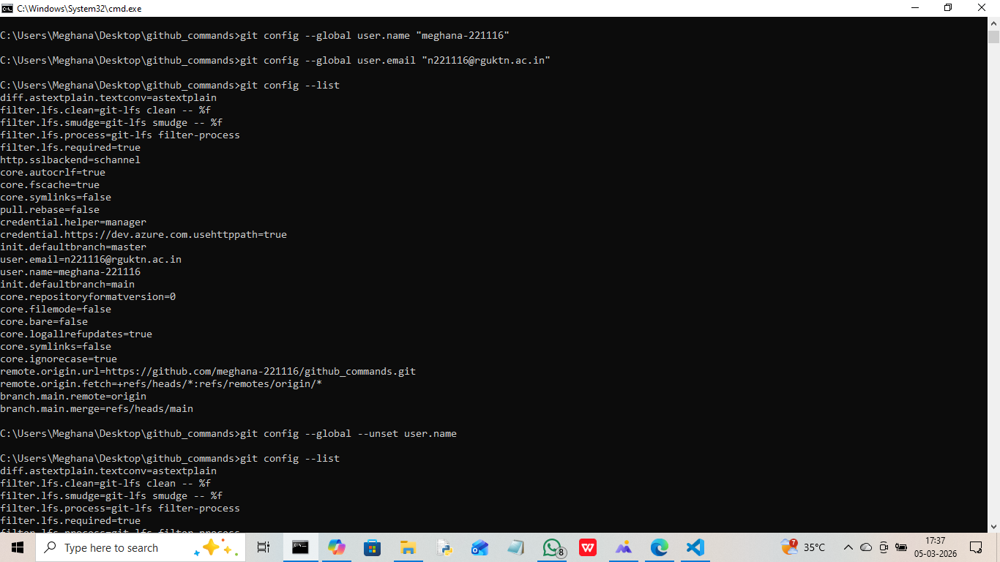

Git Configuration Commands

git config --global user.name

Syntax:
git config --global user.name "Your Name"

Purpose:
Sets the global username for Git commits.

Example:
git config --global user.name "Tulasi"

git config --global user.email

Syntax:
git config --global user.email "yourmail@gmail.com
"

Purpose:
Sets the global email for Git commits.

Example:
git config --global user.email "tulasi@gmail.com
"

git config --list

Syntax:
git config --list

Purpose:
Displays all Git configuration settings.

Example:
git config --list

git config --unset

Syntax:
git config --unset user.name

Purpose:
Removes a configuration setting.

Example:
git config --unset user.name

Screenshot:

Repository Setup Commands

git init

Syntax:
git init

Purpose:
Initializes a new Git repository.

Example:
git init

git clone

Syntax:
git clone repository-url

Purpose:
Copies an existing repository.

Example:
git clone https://github.com/Tulasi-220991/github_commands.git

git clone --branch

Syntax:
git clone --branch branch-name repository-url

Purpose:
Clones a specific branch.

Example:
git clone --branch main https://github.com/Tulasi-220991/github_commands.git

Screenshot:

git clone --depth

Syntax:
git clone --depth 1 repository-url

Purpose:
Creates a shallow clone.

Example:
git clone --depth 1 https://github.com/Tulasi-220991/github_commands.git

Screenshot:

Repository Status & Inspection

git status

Syntax:
git status

Purpose:
Shows repository status.

Example:
git status

git log

Syntax:
git log

Purpose:
Displays commit history.

Example:
git log

Screenshot:
(Insert screenshot here)

git log --oneline

Syntax:
git log --oneline

Purpose:
Short commit history.

Example:
git log --oneline

git log --graph

Syntax:
git log --graph

Purpose:
Shows commit graph.

Example:
git log --graph

git show

Syntax:
git show HEAD

Purpose:
Shows commit details.

Example:
git show HEAD

git diff

Syntax:
git diff

Purpose:
Shows unstaged changes.

Example:
git diff

git diff --staged

Syntax:
git diff --staged

Purpose:
Shows staged changes.

Example:
git diff --staged

git blame

Syntax:
git blame file-name

Purpose:
Shows line-wise author info.

Example:
git blame git_industry_commands.md

git reflog

Syntax:
git reflog

Purpose:
Shows HEAD history.

Example:
git reflog

git shortlog

Syntax:
git shortlog

Purpose:
Commit summary by author.

Example:
git shortlog

Screenshot:

File Tracking Commands

git add

Syntax:
git add file-name

Purpose:
Adds file to staging area.

Example:
git add test.txt

git add .

Syntax:
git add .

Purpose:
Adds all files.

Example:
git add .

git add -p

Syntax:
git add -p

Purpose:
Adds changes interactively.

Example:
git add -p

Screenshot:

git restore

Syntax:
git restore file-name

Purpose:
Restores working directory file.

Example:
git restore test.txt

git restore --staged

Syntax:
git restore --staged file-name

Purpose:
Unstages a file.

Example:
git restore --staged test.txt

git rm

Syntax:
git rm file-name

Purpose:
Removes tracked file.

Example:
git rm test.txt

git mv

Syntax:
git mv old-name new-name

Purpose:
Renames file.

Example:
git mv old.txt new.txt

Screenshot:

Commit Commands

git commit

Syntax:
git commit

Purpose:
Commits staged changes.

Example:
git commit

git commit -m

Syntax:
git commit -m "message"

Purpose:
Commit with message.

Example:
git commit -m "Initial commit"

Screenshot:

git commit --amend

Syntax:
git commit --amend

Purpose:
Modify last commit.

Example:
git commit --amend

Screenshot:

git commit --no-edit

Syntax:
git commit --no-edit

Purpose:
Amend without changing message.

Example:
git commit --amend --no-edit

Screenshot:

Branch Management Commands

git branch

Syntax:
git branch

Purpose:
Lists branches.

Example:
git branch

git branch -a

Syntax:
git branch -a

Purpose:
Lists all branches.

Example:
git branch -a

git branch -d

Syntax:
git branch -d branch-name

Purpose:
Deletes branch.

Example:
git branch -d test-branch

git branch -D

Syntax:
git branch -D branch-name

Purpose:
Force deletes branch.

Example:
git branch -D test-branch

Screenshot:

git checkout

Syntax:
git checkout branch-name

Purpose:
Switch branch.

Example:
git checkout main

git checkout -b

Syntax:
git checkout -b branch-name

Purpose:
Create and switch branch.

Example:
git checkout -b feature-branch

Screenshot:

git switch

Syntax:
git switch branch-name

Purpose:
Switch branch.

Example:
git switch main

git switch -c

Syntax:
git switch -c branch-name

Purpose:
Create and switch branch.

Example:
git switch -c new-branch

screenshot:

Merge & Integration Commands

git merge

Syntax:
git merge branch-name

Purpose:
Merges branch.

Example:
git merge feature-branch

git merge --no-ff

Syntax:
git merge --no-ff branch-name

Purpose:
Creates merge commit.

Example:
git merge --no-ff feature-branch

Screenshot:

Remote Repository Commands

git remote

Syntax:
git remote

Purpose:
Shows remotes.

Example:
git remote

git remote -v

Syntax:
git remote -v

Purpose:
Shows remote URLs.

Example:
git remote -v

git remote add

Syntax:
git remote add name url

Purpose:
Adds remote.

Example:
git remote add origin https://github.com/SriVaishnavi-221142/Github_commands.git

git remote remove

Syntax:
git remote remove name

Purpose:
Removes remote.

Example:
git remote remove origin

git fetch

Syntax:
git fetch

Purpose:
Fetches updates.

Example:
git fetch

git fetch --all

Syntax:
git fetch --all

Purpose:
Fetches all remotes.

Example:
git fetch --all

git pull

Syntax:
git pull

Purpose:
Fetch and merge.

Example:
git pull

git pull --rebase

Syntax:
git pull --rebase

Purpose:
Pull with rebase.

Example:
git pull --rebase

git push

Syntax:
git push

Purpose:
Push changes.

Example:
git push

git push -u origin branch-name

Syntax:
git push -u origin branch-name

Purpose:
Push and set upstream.

Example:
git push -u origin main

git push --force

Syntax:
git push --force

Purpose:
Force push.

Example:
git push --force

Screenshot:

Stash Commands

git stash

Syntax:
git stash

Purpose:
Temporarily saves uncommitted changes.

Example:
git stash

git stash list

Syntax:
git stash list

Purpose:
Displays list of stashed changes.

Example:
git stash list

git stash pop

Syntax:
git stash pop

Purpose:
Applies and removes latest stash.

Example:
git stash pop

git stash apply

Syntax:
git stash apply

Purpose:
Applies stash without removing it.

Example:
git stash apply

screenshot:

git stash drop

Syntax:
git stash drop stash@{0}

Purpose:
Deletes a specific stash.

Example:
git stash drop stash@{0}

git stash clear

Syntax:
git stash clear

Purpose:
Deletes all stashes.

Example:
git stash clear

Reset & Undo Commands

git reset

Syntax:
git reset

Purpose:
Unstages files from staging area.

Example:
git reset

git reset --soft

Syntax:
git reset --soft HEAD~1

Purpose:
Moves HEAD but keeps changes staged.

Example:
git reset --soft HEAD~1

git reset --mixed

Syntax:
git reset --mixed HEAD~1

Purpose:
Moves HEAD and unstages changes.

Example:
git reset --mixed HEAD~1

git reset --hard

Syntax:
git reset --hard HEAD~1

Purpose:
Moves HEAD and deletes changes permanently.

Example:
git reset --hard HEAD~1

screenshot:

git revert

Syntax:
git revert commit-id

Purpose:
Creates a new commit that undoes changes.

Example:
git revert HEAD

screenshot:

git clean -f

Syntax:
git clean -f

Purpose:
Removes untracked files.

Example:
git clean -f

git clean -fd

Syntax:
git clean -fd

Purpose:
Removes untracked files and directories.

Example:
git clean 

screenshot:

Rebasing Commands

git rebase

Syntax:
git rebase branch-name

Purpose:
Reapplies commits on top of another branch.

Example:
git rebase main

git rebase -i

Syntax:
git rebase -i HEAD~2

Purpose:
Interactive rebase for editing commits.

Example:
git rebase -i HEAD~2

Screenshot:
(Insert screenshot here)

git rebase --continue

Syntax:
git rebase --continue

Purpose:
Continues rebase after resolving conflicts.

Example:
git rebase --continue

git rebase --abort

Syntax:
git rebase --abort

Purpose:
Cancels rebase process.

Example:
git rebase --abort

screenshot:

Cherry Pick & Patch Commands

git cherry-pick

Syntax:
git cherry-pick commit-id

Purpose:
Applies a specific commit from another branch.

Example:
git cherry-pick abc1234

git format-patch

Syntax:
git format-patch -1 commit-id

Purpose:
Creates patch file from commit.

Example:
git format-patch -1 abc1234

git apply

Syntax:
git apply patch-file

Purpose:
Applies patch file.

Example:
git apply 0001-sample.patch

Screenshot:

git am

Syntax:
git am patch-file

Purpose:
Applies patch as commit.

Example:
git am 0001-sample.patch

Screenshot:

Tagging Commands

git tag

Syntax:
git tag

Purpose:
Lists all tags.

Example:
git tag

git tag -a

Syntax:
git tag -a v1.0 -m "Version 1"

Purpose:
Creates annotated tag.

Example:
git tag -a v1.0 -m "Version 1"

git tag -d

Syntax:
git tag -d tag-name

Purpose:
Deletes a tag.

Example:
git tag -d v1.0

screenshot:

git push origin --tags

Syntax:
git push origin --tags

Purpose:
Pushes all tags to remote.

Example:
git push origin --tags

Screenshot:

Submodule Commands

git submodule add

Syntax:
git submodule add repository-url

Purpose:
Adds a submodule to project.

Example:
git submodule add https://github.com/SriVaishnavi-221142/Github_commands.git

screenshot:

git submodule init

Syntax:
git submodule init

Purpose:
Initializes submodule configuration.

Example:
git submodule init

git submodule update

Syntax:
git submodule update

Purpose:
Updates submodules.

Example:
git submodule update

Screenshot:

Debugging Commands

git bisect

Syntax:
git bisect

Purpose:
Finds commit that introduced bug.

Example:
git bisect

git bisect start

Syntax:
git bisect start

Purpose:
Starts bisect process.

Example:
git bisect start

git bisect good

Syntax:
git bisect good commit-id

Purpose:
Marks commit as good.

Example:
git bisect good abc1234

git bisect bad

Syntax:
git bisect bad

Purpose:
Marks commit as bad.

Example:
git bisect bad

Screenshot:
